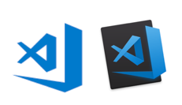

This is our code editor of choice. There are many other great editors, but here we like <a href="https://twitter.com/code" target="_blank">@code</a> best. The code editor is like a craftsman toolbox. You should know it well, be a true master of the toolbox and make it work for you. Try to continuously improve your code editor skills, use the various VsCode extensions, keyboard shortcuts, snippets and many other cool features.

We will not have a dedicated lecture about VsCode. But through the lectures we will use the editor extensively so it is expected that you will get better over time. And you really should strive to get better, learn the the features as it will make you more productive.
The docs are very well written and we recommend that you sometimes visit https://code.visualstudio.com/docs
