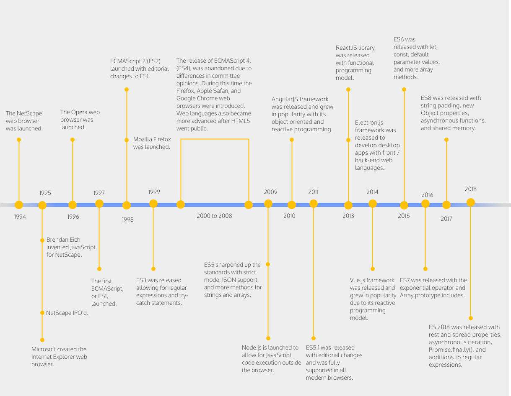

---

> _JavaScript is a prototype-based, multi-paradigm, dynamic language, supporting object-oriented, imperative, and declarative (e.g. functional programming) styles._

---

The definition above is taken from the [MDN](https://developer.mozilla.org/en-US/docs/Web/JavaScript) (highly recommended reference guide for web developers).
We can see many many "big" words here, not all, if any, meaningful to you now. At the end of the bootcamp we will come back to this definition and discuss whether the definition is any more clear than it is now. It should be I hope :)

For now we can simply say that javaScript is simple but powerful programming language that can be used to create interactive web applications that run in the browser. It is also used in other [non-browser environments](https://en.wikipedia.org/wiki/JavaScript#Uses_outside_Web_pages) (e.g. server backend services).

### What's in a name?

    ActionScript, JavaScript, JScript, ECMAScript

These are all synonyms! The history of the language is a bit chaotic, the consequence being a naming confusion. The name in use is "JavaScript" and we will stick with that.

### The history

Language evolved extensively over the years. Since the first version many new features were added and some initial problems fixed.

`Genesis (1995)`

The beginnings, language was born in NetScape. Very rushed with many problems. It is said that the first version was entirely implemented by one engineer [Brandan Eich](https://twitter.com/BrendanEich) in only 10 days.

`ES1 (1997)`

`ES5 (2010)`

introduced strict mode, JSON support and other improvements. Today still the most used version and transpilation target.

`ES6 (2015)`

sometimes referred to as "ES2015".
introduced let & const

`ES7 (2016)`

exponential operator

`ES8 (2017)`

async functions

`ES9 (2018)`

introduced rest and spread operators

### Transpilation

The target environment that will execute our javaScript code might not implement the latest standard or implement it only partially. Meaning we can't use all the bells and whistles of the latest language version. But we have special tools called "transpilers" that are capable of converting the javaScript code from higher version into semantically equal code in some lower version. Usually we use features from the latest version (ES 2018) and transpiler converts it to the lower version (ES5).
Most popular such tool is ["Babel"](https://babeljs.io/). Programming in javaScript today without Babel would much harder.
